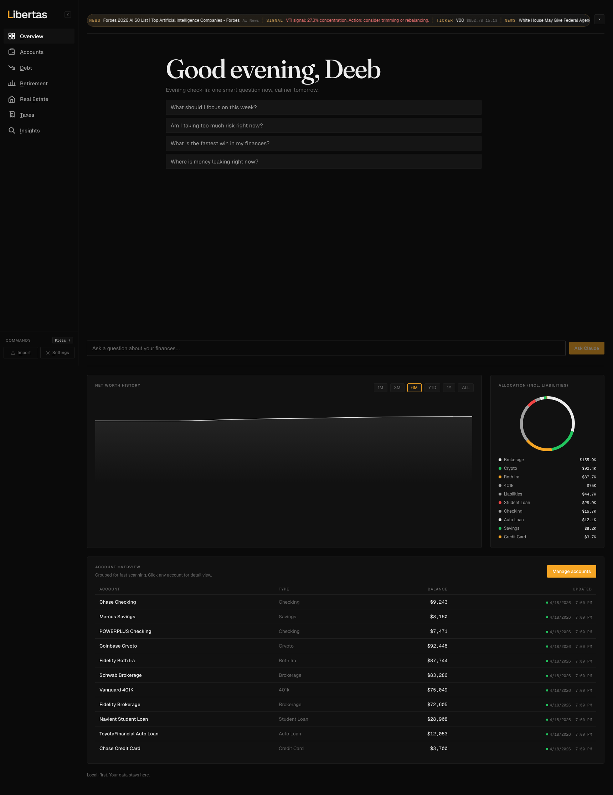
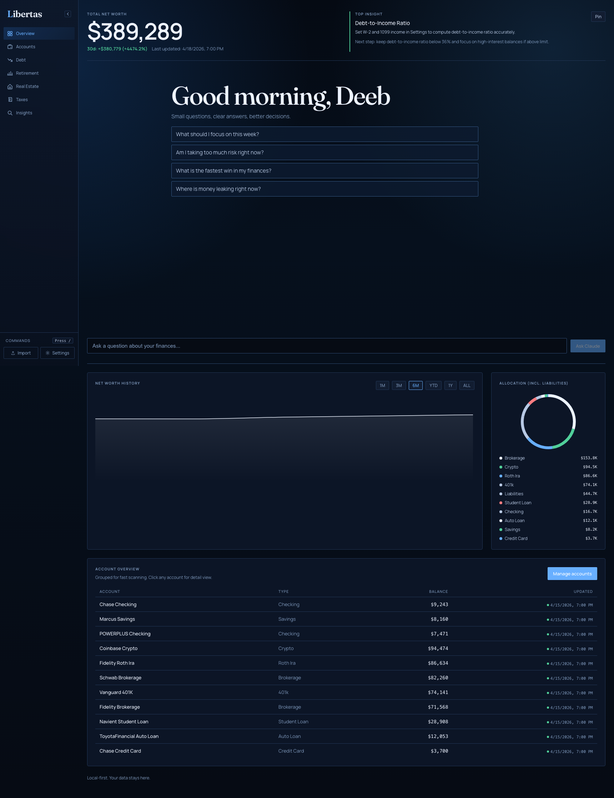

# Libertas

Local-first personal finance dashboard. No SaaS. No cloud sync. No mandatory account linking. Your data stays on your machine.

## Themes

**Onyx** (terminal black + amber) and **Retro** (deep navy + blue glow) — toggle in Settings.

| Onyx | Retro |
|------|-------|
|  |  |

## What it does

- Net worth timeline with snapshot history and range controls
- Accounts, holdings, and debt across brokerages, banks, crypto, and real estate
- Retirement planning (5 FIRE types), tax estimates, debt payoff strategies
- Rule-based insights engine (15 deterministic rules, fully offline)
- ⌘K command palette + chord keyboard navigation
- At-rest AES-256-GCM encryption on all sensitive fields in SQLite
- Optional: AI chat (Claude key), Plaid sync, Google Sheets CSV feeds

## Quick start

**Requirements:** Python 3.11+, `uv`, `bun`

```bash
./start.sh
```

- Backend API → `http://127.0.0.1:8000`
- Frontend → `http://127.0.0.1:5173` (or `5174`)

Open the frontend URL. Backend must be running but you don't interact with it directly.

## Optional API keys

Set in **Settings** inside the app (stored locally):

| Key | Purpose |
|-----|---------|
| Claude API | Insights chat + AI guidance |
| News API | Market news (falls back to RSS if absent) |
| Plaid | Optional bank sync |

## Data ingest

1. Manual entry in-app
2. CSV/Excel import (drag-and-drop or `/data/watch/` folder auto-detection)
3. Optional Plaid sync
4. Optional Google Sheets CSV feed

Built-in presets: Fidelity, Schwab, Robinhood, Coinbase, Chase, Vanguard.

## Stack

| Layer | Tech |
|-------|------|
| Backend | FastAPI + SQLAlchemy + SQLite |
| Frontend | React 18 + TypeScript + Vite + Recharts |
| Prices | yfinance (stocks) + CoinGecko (crypto) |
| Docs | VitePress → GitHub Pages |

## Docs

```bash
./start-docs.sh   # http://localhost:5173/Libertas/
```

ADRs in `docs/adr/` cover every major architectural decision (001–010).

## Recapture screenshots

```bash
./start.sh                                    # terminal 1
node frontend/scripts/capture-doc-screenshots.mjs  # terminal 2
```

Images write to `docs/public/screenshots/`.
